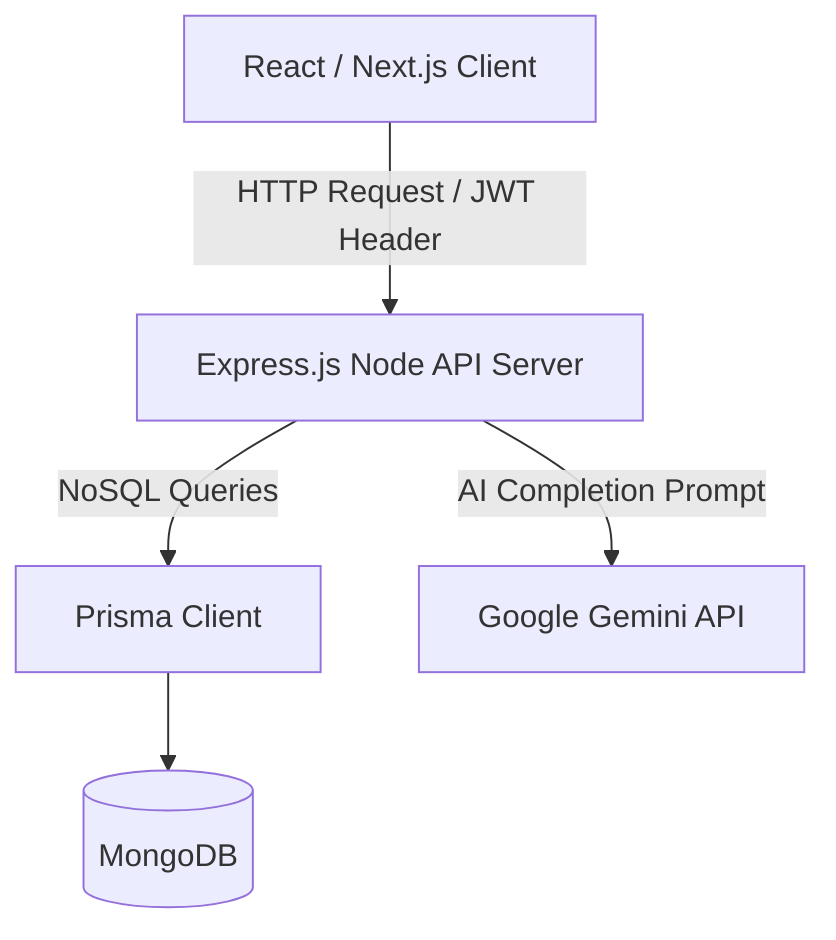
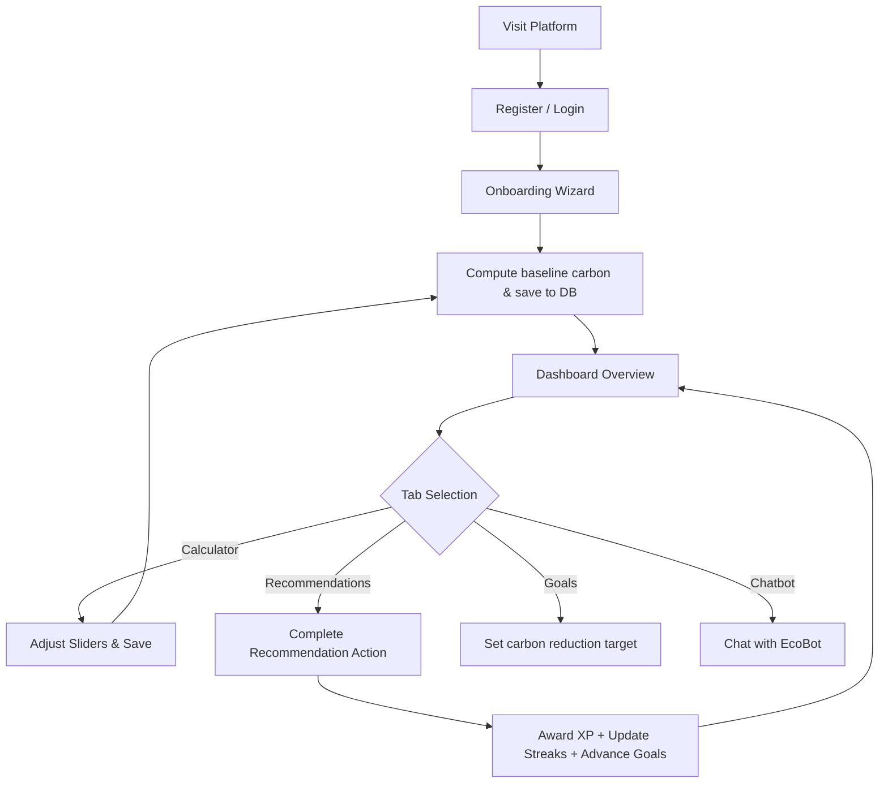

<<<<<<< HEAD
# EcoCarbon - AI-Powered Carbon Footprint Reduction Assistant

EcoCarbon is a production-ready, full-stack application designed to help individuals calculate, track, and mitigate their environmental footprint. Combining localized carbon calculation, dynamic behavioral recommendations, gamified milestone tracking, and a context-aware AI chat assistant, the platform helps users build habits that reduce greenhouse gas emissions.

---

## 1. Product Vision & Feature Breakdown

### Product Vision
To empower people of all backgrounds—students, families, and professionals—to actively fight climate change by demystifying carbon footprint tracking. EcoCarbon shifts climate action from abstract data to clear, micro-actionable daily steps that save money and build lasting eco-friendly habits.

### Core Feature Breakdown
1. **AI Sustainability Profile (Onboarding)**: Gathers age, location, dietary choices, commute modes, electricity bills, AC runtime, and shopping habits to model a personalized baseline.
2. **Dynamic Carbon Footprint Calculator**: Tracks month-over-month greenhouse gas emissions across five categories (Transport, Home Energy, Food, Shopping, Waste) using local electrical grid coefficients.
3. **AI Recommendation Engine**: Generates action cards ranked by `Impact Score = CO2 Reduction × Feasibility × Preference Weight` and grouped into Quick Wins, Moderate Actions, and High Impact Changes.
4. **Goal Tracking System**: Tracks customized target metrics (e.g. reduce commuter carbon by 20%) with live progress bars and streak rewards.
5. **Sustainability Score (0-100)**: Evaluates user behaviors and penalizes high-emission choices while rewarding solar adoption, vegan/vegetarian diets, and waste recycling.
6. **Gamification Progression**: Accelerates motivation using levels (500 XP per level), active streak counters, and glowing achievement badges.
7. **Context-Aware AI Chat Assistant (EcoBot)**: Allows conversational messaging with custom carbon questions, powered by Gemini API (with a rule-based fallback system).
8. **Visual Analytics Dashboard**: Visualizes emissions using responsive pie charts, line plots, and monthly stacked bar charts.

---

## 2. User Stories
* **As a student**, I want to see low-cost or free actions (like cycling or turning off AC early) so that I can reduce my footprint on a limited budget.
* **As a busy working professional**, I want to set automated goals and receive high-impact recommendations (like carpooling 3 days/week) so that I can maximize my environmental impact with minimal effort.
* **As an eco-conscious homeowner**, I want to simulate how installing solar panels or switching to an EV impacts my monthly carbon score before buying.
* **As a first-time sustainability user**, I want to chat with an AI assistant to easily understand why eating beef daily has a higher footprint than chicken without reading long scientific papers.

---

## 3. Wireframe & User Interface Layouts
* **Auth Page**: Modern glassmorphic panel with high-contrast inputs for logging in or signing up.
* **Onboarding Questionnaire Wizard**: Step-by-step slider settings for lifestyle factors with real-time carbon preview widgets.
* **Dashboard Tab**: Displays a grid of stats (Sustainability Score, monthly emissions, streak count, level) followed by AI summary insights, category pie charts, and monthly history bars.
* **Calculator Tab**: Form sliders for adjusting commutes, shopping, AC runtimes, and diets. Saves history points directly.
* **Recommendations Tab**: Three-column dashboard showing Quick Wins, Moderate Actions, and High Impact cards with active "Complete" and "Dismiss" triggers.
* **Goals Tab**: Dynamic goal creation widget beside a list of active goals with animated progress bars.
* **Chat Tab (EcoBot)**: Messenger window with message bubbles, prompt cards for quick questions, loading animations, and an input bar.
* **Achievements Tab**: Clean grid of glowing unlocked badges alongside locked milestones.

---

## 4. System Architecture & User Flow



### User Flow Diagram


---

## 5. Carbon Calculation Formulas

Emissions are calculated monthly using localized grid parameters:

1. **Transportation**:
   $$\text{Transport Emissions (kg CO}_2\text{/month)} = (\text{Weekly Commute Distance} \times 4.33 \times \text{Factor}) + \left(\frac{\text{Annual Flight Hours}}{12} \times 90\right)$$
   * Petrol Car Factor: $0.18$
   * Electric Car (EV) Factor: $0.05$
   * Motorcycle Factor: $0.10$
   * Public Transport (Train/Bus) Factor: $0.06$
   * Walking / Cycling: $0.00$

2. **Home Energy**:
   $$\text{Energy Emissions (kg CO}_2\text{/month)} = (\text{Monthly Electricity kWh} \times \text{Grid Factor}) + (\text{AC Hours} \times 30 \times 1.5 \times \text{Grid Factor})$$
   * Grid factors: India ($0.82$), USA ($0.38$), Europe ($0.25$), Global Default ($0.50$).

3. **Food Habits**:
   $$\text{Food Emissions (kg CO}_2\text{/month)} = \text{Daily Diet Factor} \times 30$$
   * Vegan: $1.5$ | Vegetarian: $2.5$ | Low Meat: $4.0$ | High Meat: $7.5$

4. **Shopping Habits**:
   * Minimalist: $15\text{ kg CO}_2\text{/month}$
   * Average: $50\text{ kg CO}_2\text{/month}$
   * Frequent: $150\text{ kg CO}_2\text{/month}$

5. **Waste Generation**:
   $$\text{Waste Emissions (kg CO}_2\text{/month)} = 15.0 \times (1 - (0.6 \times \text{Recycling Rate}))$$

---

## 6. AI Recommendation Engine Scoring Logic

Recommendations are ranked dynamically based on their relevance and impact:

$$\text{Impact Score} = \text{Carbon Reduction} \times \text{Feasibility} \times \text{Preference Modifier}$$

* **Feasibility Weight**: Low Difficulty ($1.0$), Medium Difficulty ($0.7$), High Difficulty ($0.4$).
* **Preference Modifier**: If a category (e.g. Transport) makes up the largest slice of a user's total footprint, a category boost modifier of $1.5$ is applied to elevate those actions to the top.

---

## 7. Security Strategy
* **JWT Authentication**: Secure tokens signed with HS256 containing expiration times. Passed in the `Authorization` header.
* **Password Hashing**: Salted hashing using `bcryptjs` with 10 rounds.
* **Input Validation**: Request bodies validated against Zod schemas on both frontend and backend to block malicious payloads.
* **SQL Injection & XSS Protections**: Prisma ORM sanitizes queries to prevent injection attacks. Custom security headers (X-Frame-Options, X-Content-Type-Options, X-XSS-Protection) are applied as middleware.

---

## 8. Accessibility Strategy
* **Keyboard Navigation**: All interactive forms, buttons, and navigation elements are keyboard tabbable.
* **Semantic HTML**: Fully built using HTML5 tags (`<aside>`, `<header>`, `<main>`, `<nav>`).
* **High Contrast Dark Theme**: Emerald and blue focus states over dark slate backgrounds to ensure WCAG color contrast compliance.

---

## 9. Folder Structure

```
/
├── backend/
│   ├── src/
│   │   ├── config/          # Prisma database config
│   │   ├── controllers/     # Route handlers (auth, profile, chat, goals, etc.)
│   │   ├── middleware/      # Auth, Zod validation, error handler, security
│   │   ├── routes/          # Express route bindings
│   │   ├── services/        # Carbon, AI reasoning, recommendation, gamification
│   │   ├── __tests__/       # Backend Jest unit & integration tests
│   │   └── index.ts         # Server entry point
│   ├── prisma/
│   │   └── schema.prisma    # PostgreSQL Database Schema
│   ├── tsconfig.json
│   └── package.json
├── frontend/
│   ├── src/
│   │   ├── app/             # Next.js App Router files
│   │   │   ├── globals.css  # Tailwind V4 glassmorphism styles
│   │   │   ├── layout.tsx   # Base HTML structure with SEO meta tags
│   │   │   └── page.tsx     # SPA interface tabs containing Recharts and forms
│   │   └── services/        # Frontend API client
│   ├── package.json
│   └── Dockerfile
├── docker-compose.yml       # Production/Local PostgreSQL and services compose orchestrator
└── README.md                # System documentation
```

---

## 10. Development & Local Setup Guide

### Running local development (Using Docker - Recommended)
1. Configure your environment variable in `.env` or pass it during docker-compose up:
   ```bash
   export GEMINI_API_KEY="your_api_key_here"
   ```
2. Run docker compose:
   ```bash
   docker-compose up --build
   ```
3. Open your browser:
   * Frontend: `http://localhost:3000`
   * Backend: `http://localhost:5000`

### Running manual development servers
#### Prerequisites
* Node.js v18+
* MongoDB database instance (local or Atlas)

#### 1. Setup Backend
1. Go to backend directory:
   ```bash
   cd backend
   ```
2. Install packages:
   ```bash
   npm install
   ```
3. Add database connection and JWT secret in `.env`:
   ```env
   DATABASE_URL="mongodb://localhost:27017/carbon?replicaSet=rs0&directConnection=true"
   JWT_SECRET="your_jwt_secret"
   GEMINI_API_KEY="your_gemini_api_key"
   ```
4. Push database schema to MongoDB:
   ```bash
   npx prisma db push
   ```
5. Run tests:
   ```bash
   npm run test
   ```
6. Start dev server:
   ```bash
   npm run dev
   ```


#### 2. Setup Frontend
1. Go to frontend directory:
   ```bash
   cd ../frontend
   ```
2. Install packages:
   ```bash
   npm install
   ```
3. Start Next.js development server:
   ```bash
   npm run dev
   ```
4. Access app at `http://localhost:3000`.

---

## 11. Future Enhancements
* **Real-time Utility Bill Integration**: Integration with utility APIs (Smart Plugs, PG&E, etc.) to automate electricity inputs.
* **Community Challenges**: Cooperative team-based reduction challenges (e.g. "College Dorm Energy Challenge").
* **OCR Receipt Scanner**: Scanning shopping and grocery receipts to automatically compute food and retail carbon emissions using receipt text parsing.
=======
# Virtual_promptwars_03
>>>>>>> 7c5d16b5de017e06a050fcd85f3030d89c561b9c
